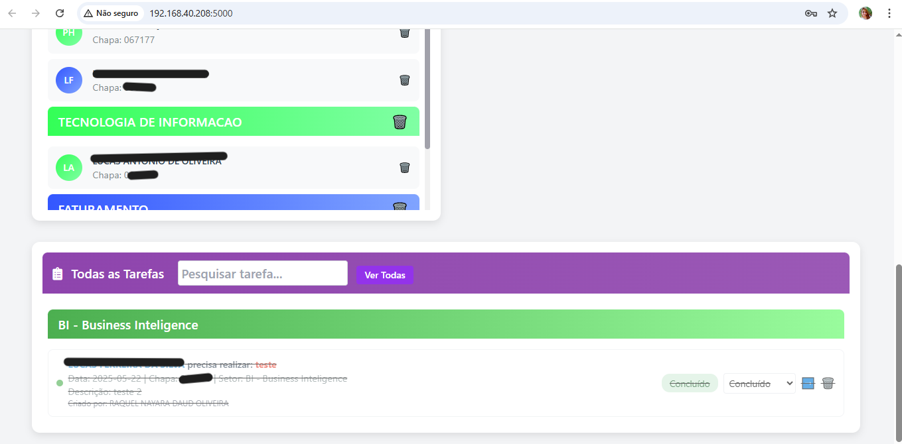
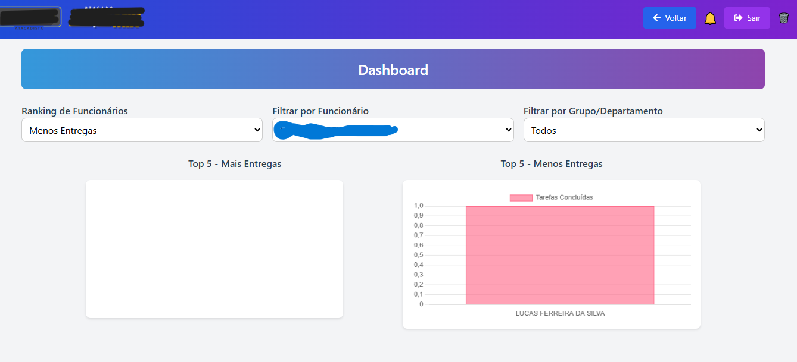

# 🗂️ Gerenciador de Tarefas

Sistema de gerenciamento de tarefas com dashboards interativos, gráficos por setor e controle individualizado de entregas. Ideal para gestão de equipes e visualização de desempenho por colaborador ou grupo.

## 💻 Tecnologias utilizadas

- Python
- Flask
- HTML/CSS
- Tailwind
- Chart.js
- Banco de dados: MySQL e Oracle (TOTVS RM)
- Automatizações com Python
- Dashboards interativos

## 📊 Funcionalidades

- Criação e gestão de tarefas individuais e em grupo
- Dashboard com gráficos por colaborador e setor
- Análise de tempo de entrega
- Filtros interativos por período, status e responsável
- Login por chapa com senha personalizada
- Notificações em tempo real e auditoria de ações

## 🖼️ Exemplos visuais

| Dashboard | Colaboradores | Tarefas |
|----------|----------------|--------|
|  |  | %2020.58.41_6532e51a.jpg) |

## 📬 Contato

- [LinkedIn - Raquel Daud](https://www.linkedin.com/in/raquel-daud-72a3991a2/)
- 📧 Email: daudpython@gmail.com

---

🟣 Projeto desenvolvido com apoio do ChatGPT | GPT-4 | DALL·E
